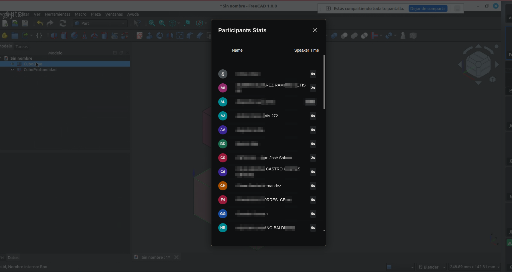

# Extract list from Jitsi Meet

## How to use

For to use the script, fist you have to click over participants (like show). Then, you have to save the **page web complete**



Then exec the script

```bash
list_jitsi.py name_file.html
```

## Details

- Have to change permissions from script
  - `sudo chmod +x list_jitsi.py`
- Or you have to add to `$PATH` system